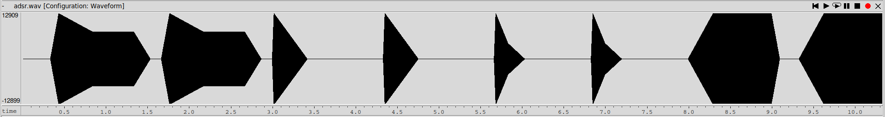
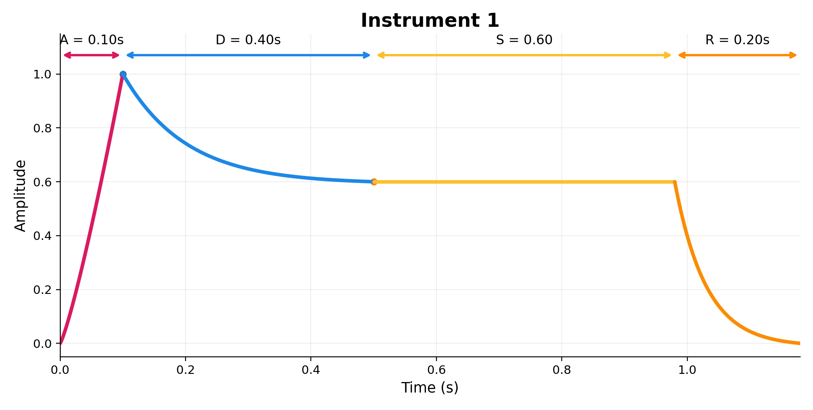
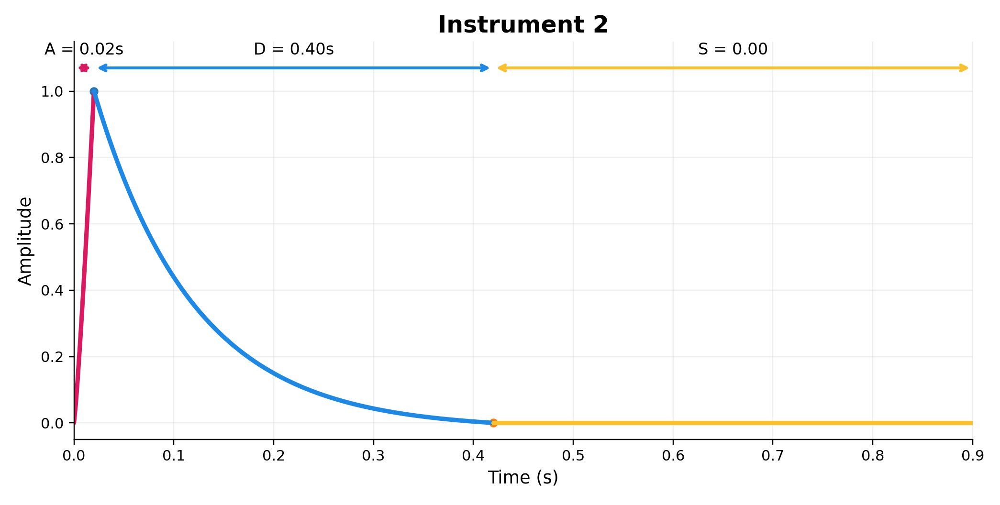
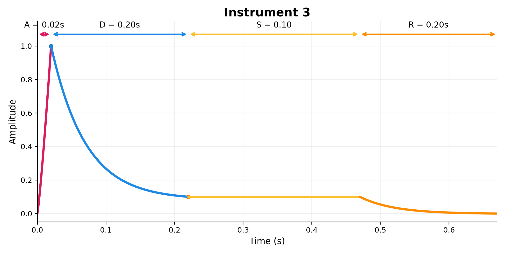
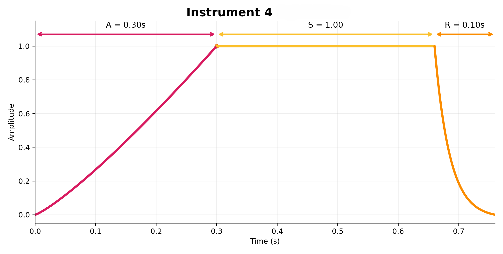
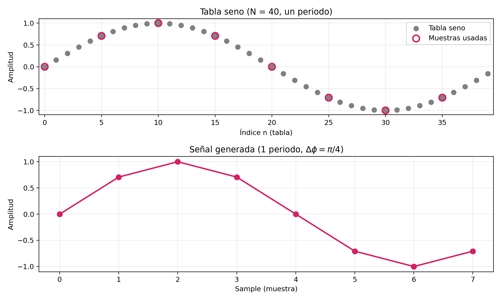
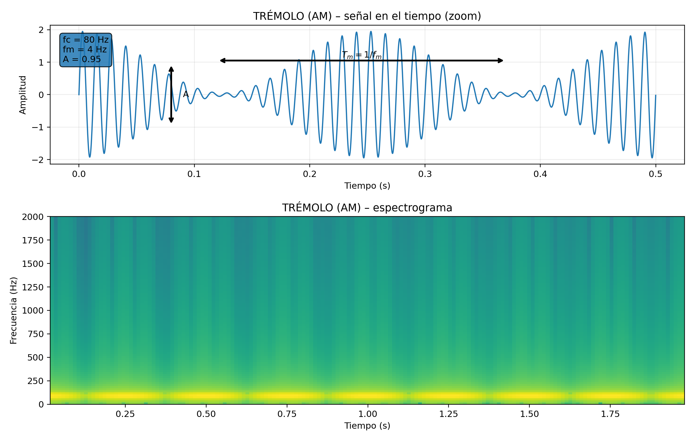
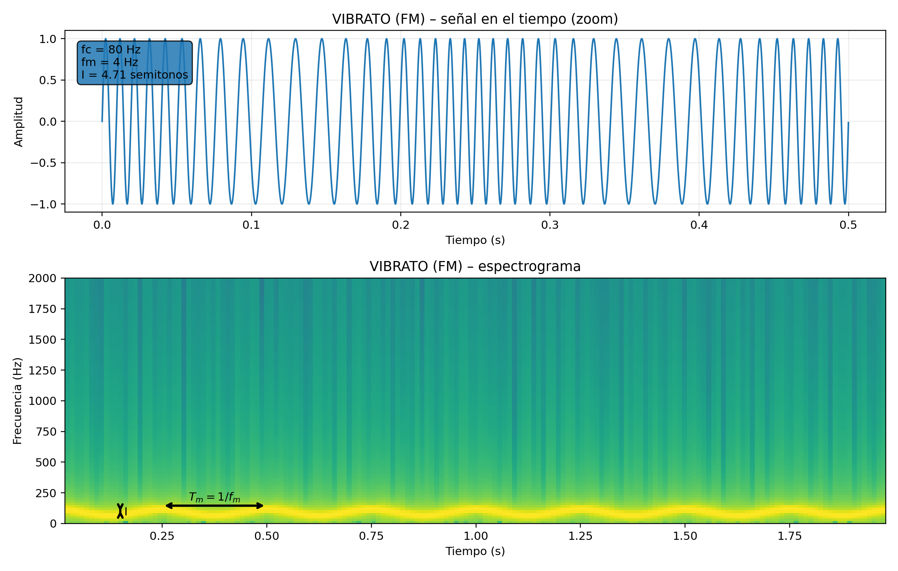
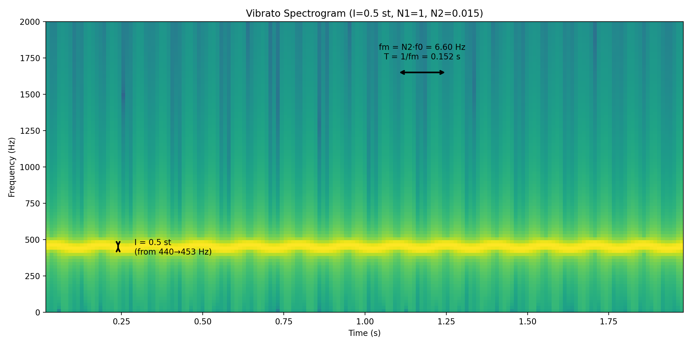

PAV - P5: síntesis musical polifónica
=====================================

Lluis Estape y Pol Gàlvez
-------------------------

Obtenga su copia del repositorio de la práctica accediendo a [Práctica 5](https://github.com/albino-pav/P5) 
y pulsando sobre el botón `Fork` situado en la esquina superior derecha. A continuación, siga las
instrucciones de la [Práctica 2](https://github.com/albino-pav/P2) para crear una rama con el apellido de
los integrantes del grupo de prácticas, dar de alta al resto de integrantes como colaboradores del proyecto
y crear la copias locales del repositorio.

Como entrega deberá realizar un *pull request* con el contenido de su copia del repositorio. Recuerde que
los ficheros entregados deberán estar en condiciones de ser ejecutados con sólo ejecutar:

~~~~~~~~~~~~~~~~~~~~~~~~~~~~~~~~~~~~~~~~~~~~~~~~~~~~~.sh
  make release
~~~~~~~~~~~~~~~~~~~~~~~~~~~~~~~~~~~~~~~~~~~~~~~~~~~~~

A modo de memoria de la práctica, complete, en este mismo documento y usando el formato *markdown*, los
ejercicios indicados.

Ejercicios.
-----------

### Envolvente ADSR.

Tomando como modelo un instrumento sencillo (puede usar el InstrumentDumb), genere cuatro instrumentos que
permitan visualizar el funcionamiento de la curva ADSR.

* Un instrumento con una envolvente ADSR genérica, para el que se aprecie con claridad cada uno de sus
  parámetros: ataque (A), caída (D), mantenimiento (S) y liberación (R).
* Un instrumento *percusivo*, como una guitarra o un piano, en el que el sonido tenga un ataque rápido, no
  haya mantenimiemto y el sonido se apague lentamente.
  - Para un instrumento de este tipo, tenemos dos situaciones posibles:
    * El intérprete mantiene la nota *pulsada* hasta su completa extinción.
    * El intérprete da por finalizada la nota antes de su completa extinción, iniciándose una disminución
	  abrupta del sonido hasta su finalización.
  - Debera representar en esta memoria **ambos** posibles finales de la nota.
* Un instrumento *plano*, como los de cuerdas frotadas (violines y semejantes) o algunos de viento. En
  ellos, el ataque es relativamente rápido hasta alcanzar el nivel de mantenimiento (sin sobrecarga), y la
  liberación también es bastante rápida.

En adsr.orc creamos los instrumentos, con sus respectivos parámetros ADSR, partiendo de instrument_dumb:
``` ruby
1	InstrumentDumb	ADSR_A=0.1; ADSR_D=0.4; ADSR_S=0.6; ADSR_R=0.2; N=40; # Cada etapa ADSR dura lo suficiente para poderse representar claramente cada parámetro de la curva

2	InstrumentDumb	ADSR_A=0.02; ADSR_D=0.4; ADSR_S=0; ADSR_R=0; N=40; # Al tener Sustain = 0, si mantenemos pulsada la tecla, el sonido se extingirá después del Delay

3	InstrumentDumb	ADSR_A=0.02; ADSR_D=0.2; ADSR_S=0.1; ADSR_R=0.2; N=40; # Si el usuario pulsa la tecla un solo instante, pasaremos directamente a la etapa de Release, lo que inicializará una extinción repentina

4	InstrumentDumb	ADSR_A=0.3; ADSR_D=0; ADSR_S=1; ADSR_R=0.1; N=40; # Ataque relativamente rápido, no hay delay (vamos directos al nivel de mantenimiento), y la liberación también es bastante rápida
```

Una vez creados, hacemos una partitura simple que consta de dos notas de cada instrumento en adsr.sco:
```
40      9       1       60      100
120     8       1       60      100
40      9       1       60      100
120     8       1       60      100

# Aquí nos aseguremos que se pulse suficiente tiempo para extinguirse
40      9       2       60      100
120     8       2       60      100
40      9       2       60      100
120     8       2       60      100

# Aquí nos aseguramos que se pulse muy poco tiempo
40      9       3       60      100
20      8       3       60      100
120     9       3       60      100
20      8       3       60      100

120     9       4       60      100
120     8       4       60      100
40      9       4       60      100
120     8       4       60      100
```
Aquí la visualización del audio generado (`work/ejercicio_adsr/adsr.wav`) con wavesurfer:

  

Podemos ver claramente como la envolvente varía dependiendo del instrumento utilizado. El **primero** tiene cada etapa ADSR bien marcada, el **segundo y tercero** tienen un ataque rápido sin mantenimiento (extinción después del ataque; como un instrumento percusivo), y el **cuarto** tiene un ataque relativamente rápido sin Delay (llegamos directamente al nivel de mantenimiento), y un Release también rápido (instrumento "plano"). 

Para el cuarto instrumento, el nivel de mantenimiento se ha puesto a 1 ya que la curva ADSR obliga el ataque a acabar en 1. Sin Delay y un S<1, estaríamos haciendo un salto directo del nivel 1 al nivel S, lo que añadiría un "click" indeseado al sonido.


Aquí las curvas ADSR (etiquetadas) de los cuatro instrumentos:

<div class="row">
  <div class="column">
  
  
  </div>
  <div class="column">
  
  
  </div>
</div>

  **NOTA:** Cabe destacar que, para el Instrumento 3, la idea es nunca llegar a la etapa de mantenimiento (se pulsa un instante), así que pasamos directamente a la etapa de Release (obteniendo un sonido percusivo).

### Instrumentos Dumb y Seno.

Implemente el instrumento `Seno` tomando como modelo el `InstrumentDumb`. La señal **deberá** formarse
mediante búsqueda de los valores en una tabla.

- Incluya, a continuación, el código del fichero `seno.cpp` con los métodos de la clase Seno.

```cpp
#include <iostream>
#include <math.h>
#include "seno.h"
#include "keyvalue.h"

#include <stdlib.h>

using namespace upc;
using namespace std;

Seno::Seno(const std::string &param) 
  : adsr(SamplingRate, param) {
  bActive = false;
  x.resize(BSIZE);

  /*
    You can use the class keyvalue to parse "param" and configure your instrument.
    Take a Look at keyvalue.h    
  */
  KeyValue kv(param);
  int N;

  if (!kv.to_int("N",N))
    N = 40; //default value
  
  // Create a tbl with one period of a sinusoidal wave
  tbl.resize(N);
  float phase = 0, step = 2 * M_PI /(float) N;
  for (int i=0; i < N ; ++i) {
    tbl[i] = sin(phase);
    phase += step;
  } // tbl stores one period of a sinusoidal wave. We'll generate different pitches by running through the table at different speeds.
}


void Seno::command(long cmd, long note, long vel) {
  if (cmd == 9) {		//'Key' pressed: attack begins
    bActive = true; // Activate instrument
    adsr.start();

    double f0 = 440.0 * pow(2.0, (note - 69.0) / 12.0); // Sine freq based on note value (see Section 3.5 in pdf)
    phaseInc = f0 * (double)tbl.size() / (double)SamplingRate; // Based on f0, what step should we take in the table for each sample

	  A = vel / 127.; // Amplitude of sine based on command's vel parameter
  }
  else if (cmd == 8) {	//'Key' released: sustain ends, release begins
    adsr.stop();
  }
  else if (cmd == 0) {	//Sound extinguished without waiting for release to end
    adsr.end();
  }
}


const vector<float> & Seno::synthesize() {
  if (not adsr.active()) {
    x.assign(x.size(), 0);
    bActive = false;
    return x;
  }
  else if (not bActive)
    return x;

  for (unsigned int i=0; i<x.size(); ++i) {

    // Check phase floor (the tbl sample index just before our phase) and phase fraction (how much over floor index are we)
    int i0 = (int)floor(phase); // Closest index below phase
    double frac = phase - i0; // How much over lower index are we
    int i1 = i0+1; // Closest index above phase

    if (i1 >= (int)tbl.size()) i1 = 0; // In case we're at the end of the table

    // Linear interpolation of table values for our phase
    double s = (1.0 - frac) * tbl[i0] + frac * tbl[i1];

    x[i] = (float)(A * s); // Generate sample
    phase += phaseInc; // Go forward phaseInc (set to match expected pitch)

    if (phase >= tbl.size())
      phase = phase-tbl.size();
  }
  adsr(x); //apply envelope to x and update internal status of ADSR

  return x;
}
```
Para conseguir crear un cambio de pitch basado en la nota que se envía, ésta se convierte a frecuencia f0 (fórmula en Sección 3.5.) y después a un salto de índice en la tabla (phaseInc). Para índices decimales, se ha usado interpolación lineal entre muestras contiguas (mirar función synthesize()).

Para comprobar su correcto funcionammiento, se ha creado el audio doremi.wav en la carpeta `work/ejercicio_seno/`.

- Explique qué método se ha seguido para asignar un valor a la señal a partir de los contenidos en la tabla,
  e incluya una gráfica en la que se vean claramente (use pelotitas en lugar de líneas) los valores de la
  tabla y los de la señal generada.

La señal se genera mediante síntesis por tabla (wavetable). Se almacena un periodo de una senoide en una tabla de N muestras. Para producir una frecuencia f0 (obtenida a partir del valor MIDI note), se recorre la tabla con un incremento fraccionario phaseInc=f0*N/Fs. En cada muestra, como el índice phase no suele ser entero, se calcula el valor de la señal (*s*) mediante interpolación lineal entre las dos muestras de tabla adyacentes. Esto nos permite generar la señal con `x[i] = (float)(A * s)`, siendo *A* la amplitud que queremos generar y *s* el valor interpolado de la tabla para ese instante. Finalmente se actualiza phase←(phase+phaseInc)modN para mantener continuidad de fase.

Aquí una **gráfica en la que se ven los valores de la tabla y los de una señal generada con saltos de fase de PI/4** (f0=5512.5 Hz usando fs=44.1kHz y una tabla de 40 muestras):

  


- Si ha implementado la síntesis por tabla almacenada en fichero externo, incluya a continuación el código
  del método `command()`. (PARA EL SENO ES MÁS CONVENIENTE **NO** HACERLO POR FICHERO EXTERNO)

### Efectos sonoros.

- Incluya dos gráficas en las que se vean, claramente, el efecto del trémolo y el vibrato sobre una señal
  sinusoidal. Deberá explicar detalladamente cómo se manifiestan los parámetros del efecto (frecuencia e
  índice de modulación) en la señal generada (se valorará que la explicación esté contenida en las propias
  gráficas, sin necesidad de *literatura*).

  **_Trémolo_:** Variación periódica de la amplitud de la señal (a una frecuencia baja). Se puede escuchar el efecto en `work/ejercicio_efectos/tremolo/`.

  

  **_Vibrato_:** Variación periódica de la frecuencia de la señal. Se puede escuchar el efecto en `work/ejercicio_efectos/vibrato/`.

  

- Si ha generado algún efecto por su cuenta, explique en qué consiste, cómo lo ha implementado y qué resultado ha producido. Incluya, en el directorio `work/ejemplos`, los ficheros necesarios para apreciar el efecto, e indique, a continuación, la orden necesaria para generar los ficheros de audio usando el programa `synth`.

En el directorio `work/ejercicio_efectos/` puede encontrar ejemplos del **_Trémolo_, _Vibrato_ y _Reverb_**, el último siendo nuestra propia adición. Hemos decidido crear este último efecto ya que nos permitirá darle un sonido más real y cálido a nuestras obras.

Sobre el _Reverb_:
1. Se ha creado el Reverb como un filtro FIR que repite el mismo sonido con un __*delay_ms*__ específico, __*taps*__ veces, y con una atenuación __*decay*__. También se mezcla con el sonido real mediante el parámetro __*mix*__ (0-1; Dry-Wet). Todos estos son parámetros de entrada: p.ej. `13 Reverb mix=0.4; decay=0.6; delay_ms=100; taps=25;`
2. Si quiere ver cómo funciona, consulte el archivo `src/effects/reverb.cpp`.
3. Cabe destacar que **se ha cambiado el archivo `src/synth/orchest.cpp`** para que este efecto funcione correctamente. Esto se debe a que anteriormente el efecto se desactivaba cuando la envolvente ADSR finalizaba, pero el _Reverb_ debería continuar hasta que la última reverberación muriera. Para corregirlo, se ha hecho que el instrumento se mantenga activo hasta que el _Reverb_ finalice del todo.

### Síntesis FM.

Construya un instrumento de síntesis FM, según las explicaciones contenidas en el enunciado y el artículo
de [John M. Chowning](https://web.eecs.umich.edu/~fessler/course/100/misc/chowning-73-tso.pdf). El
instrumento usará como parámetros **básicos** los números `N1` y `N2`, y el índice de modulación `I`, que
deberá venir expresado en semitonos.

- Use el instrumento para generar un vibrato de *parámetros razonables* e incluya una gráfica en la que se
  vea, claramente, la correspondencia entre los valores `N1`, `N2` e `I` con la señal obtenida.

Para generar un _vibrato_ de parámetros razonables, se ha creado un instrumento con los siguientes parámetros:

`1   SynthFM ADSR_A=0.1; ADSR_D=0; ADSR_S=1; ADSR_R=0.2; N=40; I=0.5; N1=1; N2=0.015;`

Puede escuchar el resultado en `work/doremi/reasonable_vibrato.wav`. Se han considerado _razonables_ estos parámetros ya que:

1. Sabemos que tenemos las siguientes correspondencias entre frecuencias: **fc​=N1⋅f0​,fm​=N2⋅f0​**.
Si escogemos N1=1, tendremos que la *carrier frequency* será igual a la nota que queremos tocar, y si escogemos N2=0.015, tenemos que la **frecuencia fm** (frecuencia del _vibrato_) **será 0.015 veces la de la nota**. Teniendo en cuenta que trabajamos con notas de aproximadamente 440Hz, esto nos daría una fm=6.6Hz, lo que produce un _vibrato razonable_.
2. Para el parámetro I, éste funciona igual que como en el efecto _Vibrato_ explicado anteriormente. **Una variación de 0.5 semitonos es entonces razonable.**

Aquí un gráfico que explica la relación entre los parámetros y la señal obtenida (tocando una nota de 440Hz -> A4):

  

- Use el instrumento para generar un sonido tipo clarinete y otro tipo campana. Tome los parámetros del
  sonido (N1, N2 e I) y de la envolvente ADSR del citado artículo. Con estos sonidos, genere sendas escalas
  diatónicas (fichero `doremi.sco`) y ponga el resultado en los ficheros `work/doremi/clarinete.wav` y
  `work/doremi/campana.wav`.

En el directorio `work/doremi/` puede encontrar los archivos .orc definiendo cada instrumento y sus correspondientes audios .wav. También se ha añadido un sonido *"brass-like"* aplicando los parámetros del paper de Chowning.

Aquí los parámetros ADSR y FM que se han usado:

1. __Clarinete__: `1   SynthFM ADSR_A=0.1; ADSR_D=0; ADSR_S=1; ADSR_R=0.2; N=40; I=4; N1=3; N2=2;`
2. __Campana__: `1   SynthFM ADSR_A=0.008; ADSR_D=0.4; ADSR_S=0.0; ADSR_R=1.2; N=40; I=4.0; N1=1; N2=1.4;`
3. __Instrumento de metal__ (como EXTRA, ya que lo piden debajo): `1   SynthFM ADSR_A=0.3; ADSR_D=0; ADSR_S=1; ADSR_R=0.3; N=40; I=3; N1=1; N2=1;`

  * También puede colgar en el directorio work/doremi otras escalas usando sonidos *interesantes*. Por
    ejemplo, violines, pianos, percusiones, espadas láser de la
	[Guerra de las Galaxias](https://www.starwars.com/), etc.

  Se ha añadido el instrumento de metal comentado anteriormente.

### Orquestación usando el programa synth.

Use el programa `synth` para generar canciones a partir de su partitura MIDI. Como mínimo, deberá incluir la
*orquestación* de la canción *You've got a friend in me* (fichero `ToyStory_A_Friend_in_me.sco`) del genial
[Randy Newman](https://open.spotify.com/artist/3HQyFCFFfJO3KKBlUfZsyW/about).

- En este triste arreglo, la pista 1 corresponde al instrumento solista (puede ser un piano, flautas,
  violines, etc.), y la 2 al bajo (bajo eléctrico, contrabajo, tuba, etc.).

Se ha escogido como instrumento 1 un clarinete y como instrumento 2 una tuba/instrumento de metal (ambos creados con el SynthFM). Se pueden ver definidos en el archivo `toy_story.orc` dentro del directorio `work/music/youve_got_a_friend_in_me`.
Se ha cambiado un poco el ataque y delay de ambos para hacer el sonido menos desagradable, y aumentado el valor de N para tener tablas con más puntos (y que haya menos distorsión). También ha habido cambios pequeños de los valores de I respecto a los del ejercicio anterior, que se han escogido a gusto de los creadores.

- Coloque el resultado, junto con los ficheros necesarios para generarlo, en el directorio `work/music`.

Se pueden ver todos los ficheros, junto con el resultado, en `work/music/youve_got_a_friend_in_me`.

- Indique, a continuación, la orden necesaria para generar la señal (suponiendo que todos los archivos necesarios están en directorio indicado).

Aquí la orden usada (la ganancia del output se ha bajado para la salud auditiva del oyente): 

`synth work/music/youve_got_a_friend_in_me/toy_story.orc work/music/youve_got_a_friend_in_me/ToyStory_A_Friend_in_me.sco work/music/youve_got_a_friend_in_me/song.wav -g 0.1 -e "work/music/youve_got_a_friend_in_me/effects.txt"`

Como puede observar, se ha añadido el efecto de Reverb en la pista 1, ya que se ha considerado que quedaba mejor con la pieza (le da un toque más suave y nostálgico).

**NOTA**: Se ha percibido que de vez en cuando la pista tiene "clicks" indeseados. Se ha intentado bajar la ganancia y hacer el ataque más largo pero ninguna de las soluciones funciona, así que dejamos esto cómo aviso.

- También puede orquestar otros temas más complejos, como la banda sonora de *Hawaii5-0* o el villacinco de
John Lennon *Happy Xmas (War Is Over)* (fichero `The_Christmas_Song_Lennon.sco`), o cualquier otra canción
de su agrado o composición. Se valorará la riqueza instrumental, su modelado y el resultado final.
- Coloque los ficheros generados, junto a sus ficheros `score`, `instruments` y `efffects`, en el directorio
  `work/music`. Indique, a continuación, la orden necesaria para generar cada una de las señales usando los distintos
  ficheros.

Hemos decidido sintetizar la pìeza **Rock With You de Michael Jackson**, que se puede encontrar en el directorio `work/music/rock_with_you/rockWithYou.wav`. Si desea generarla, use el siguiente comando:

`synth work/music/rock_with_you/instr.orc work/music/rock_with_you/Merged_multitrack.sco work/music/rock_with_you/rockWithYou.wav -g 0.2 -e "work/music/rock_with_you/effects.txt"`

Sobre la composición:
1. Como el script midi2sco nos procesaba el archivo MIDI como una sola pista, se ha decidido **pasar cada track separado** (hemos usado una DAW para separarlos en MIDIs diferentes) **a .sco** (mediante el script midi2sco) **y después juntarlos todos**, dándole un instrument ID diferente a cada track. Para juntarlos hemos usado el script de python que se puede encontrar en `work/music/rock_with_you/separated_tracks_sco/merge_sco_multitrack.py`.
2. Se ha creado el instrumento **TableSampler** que permite añadir como parámetro de entrada un archivo WAV que se usará como tabla. Esto nos ha ido bien para generar los _Drums_. Como los _Drums_ no acostumbran a cambiar de pitch (se usa el sample tal cual), hemos hecho que el phaseInc sea fijo y no dependa de la nota especificada en el comando. Si desea más información sobre el instrumento, consulta el fichero `src/instruments/table_sampler.cpp`.
3. Para consultar todos los instrumentos usados en esta pieza, consulta el fichero `work/music/rock_with_you/instr.orc`, donde se han añadido comentarios especificando qué instrumentos se usan para cada pista.
4. Para darle más calidez a la obra, se ha añadido **_Reverb_** a los instrumentos de metal de fondo.

> NOTA:
>
> No olvide escuchar el resultado generado y comprobar que no se producen ruidos extraños o distorsiones.
> Sobre todo, tenga en cuenta la salud auditiva de quien será encargado de corregir su trabajo.